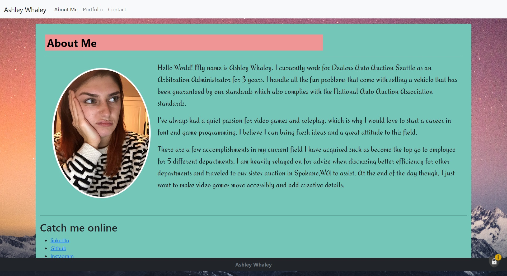
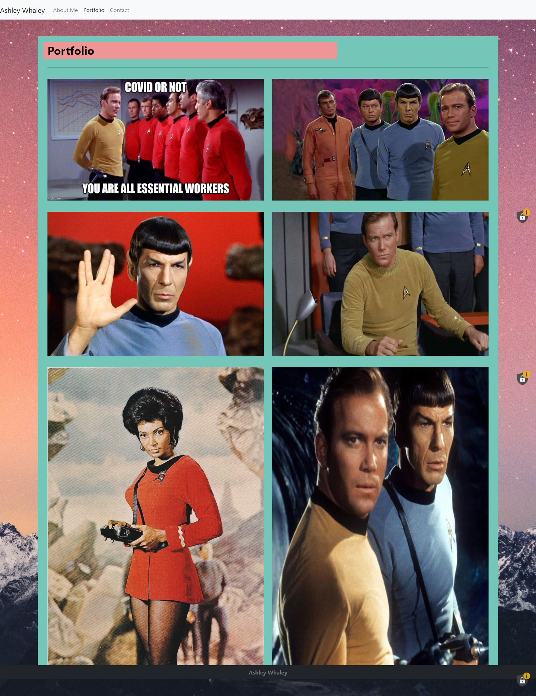
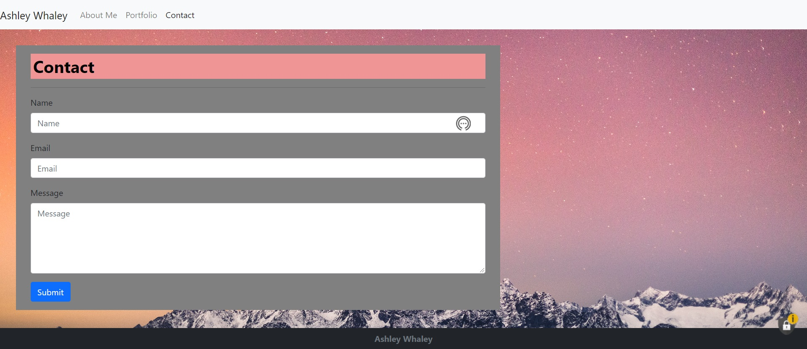

# Ashley's First Mobile Responsive Portfolio
:star_struck:
*A novice attempt to create a responsive website using bootstrap*

## Motivation

Since the world is becoming more mobile-app oriented, it is crucial to have every website accessibly through smaller and smaller devices. I have created this website to showcase my current knowledge of responsiveness through bootstrap and to introduce myself to the online community.

## Who should make it?
*Every* company should have a responsive website if they want to stay up to date with their customer base. After this project I have a better understanding to assist these companies and their needs. 

### Link to Website
[AshleysResponsiveMobilePortfolio](https://ashleywhaley.github.io/AshleysMobileResponsivePortfolio/index.html)

